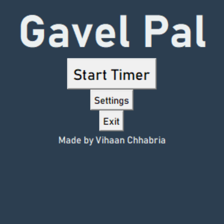
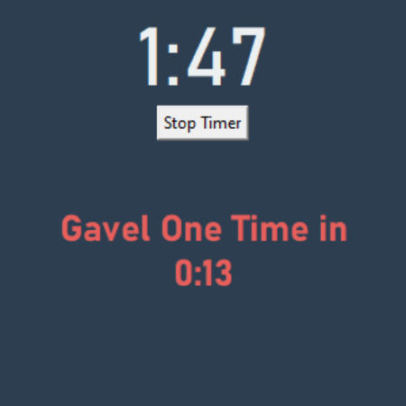

# GavelPal

GavelPal is a specialized app designed for Presiding Officers (POs) in high school speech and debate congress sessions. It aims to streamline the process of managing and conducting sessions, providing tools and features to assist POs in their duties.

## Features

- **Timer**: Built-in timer to ensure speeches adhere to time limits.
- **Visibility**: Stays on the top of the screen at all times so you do not need to switch between a timer and a PO sheet.

## Pictures




## Installation

To install GavelPal, follow these steps. If you prefer not to install the code and dependencies, you can use the provided executable file. Simply download the executable file from the releases section, drag it onto your tool bar, and click on it.

1. Clone the repository:
    ```bash
    git clone https://github.com/VihaanChhabria/GavelPal.git
    ```
2. Navigate to the project directory:
    ```bash
    cd GavelPal
    ```
3. Install the required dependencies:
    ```bash
    pip install -r requirements.txt
    ```

## Usage

To start using GavelPal, run the following command:
```bash
python main.py